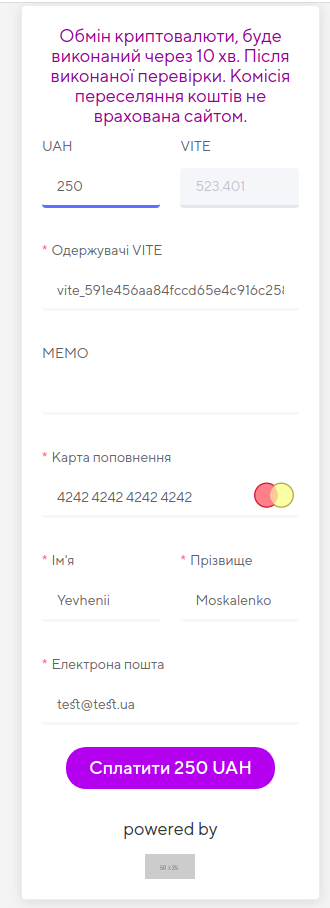

# exchange cripto from element.ui
## Головна сторінка сайту
# 
## Модальне вікно
# 
## Сплата через liqpay
# 
## Повідомлення в телеграм
# 
## На мобільному
# 
## Успіх
# 
## Занесення в базу даних
# 
## Результат в liqpay аналітиці
# 


> nuxt,vuex,express

## Build Setup

```bash
# install dependencies
$ npm install

# serve with hot reload at localhost:3000
$ npm run dev

# build for production and launch server
$ npm run build
$ npm run start

# generate static project
$ npm run generate
```

For detailed explanation on how things work, check out [Nuxt.js docs](https://nuxtjs.org).
